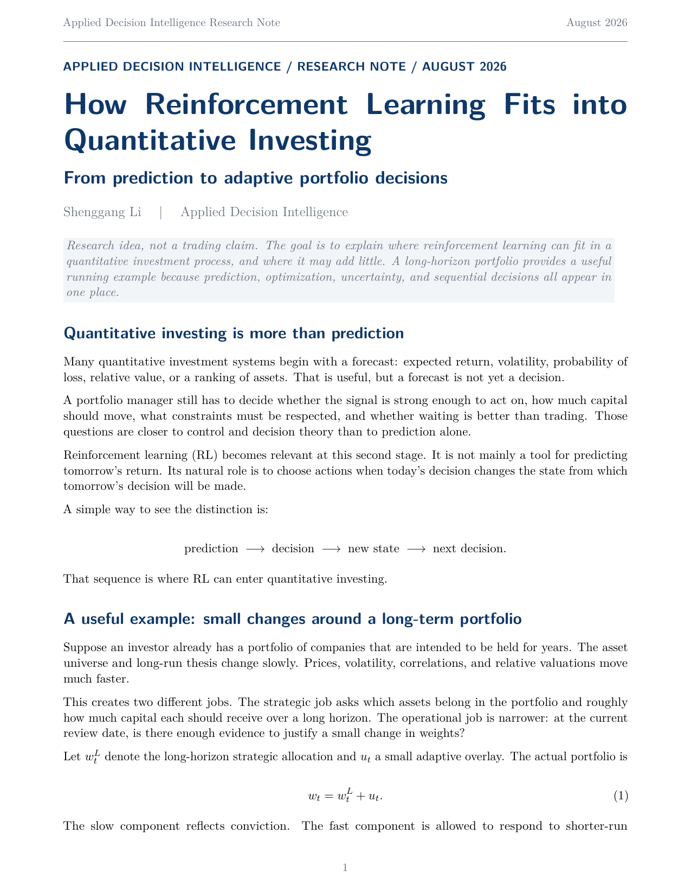

# How Reinforcement Learning Fits into Quantitative Investing

## From prediction to adaptive portfolio decisions

**Shenggang Li**  
Applied Decision Intelligence Research Note, August 2026



## Overview

Quantitative investing is often described as a forecasting problem, but a forecast is not yet a decision. A portfolio process still has to decide whether a signal is strong enough to act on, how much capital should move, which constraints matter, and whether waiting is better than trading.

This research note explains where reinforcement learning can fit into that process. The central distinction is:

$$
\text{prediction} \rightarrow \text{decision} \rightarrow \text{new state} \rightarrow \text{next decision}.
$$

RL becomes relevant when today's decision changes the state from which future decisions will be made. It is therefore presented here as a **decision layer**, not as a label for short-term trading.

## A two-timescale portfolio view

The running example separates a long-horizon strategic portfolio from a small adaptive overlay:

$$
w_t = w_t^{L} + u_t.
$$

The strategic component $w_t^{L}$ reflects slower-moving conviction. The overlay $u_t$ is bounded so that the adaptive controller can make small adjustments without replacing the long-term investment thesis.

A simple constraint is

$$
|u_{i,t}| \leq \delta_i.
$$

This turns the research problem into a narrow question: given a portfolio that is already intended to be held, when is there enough evidence to justify a small change in weights?

## Start with optimization, not RL

The note does not assume that RL is automatically better than classical optimization. A strong baseline is constrained operations research or model predictive control. For example, a small portfolio adjustment $\Delta w_t$ can be chosen by balancing estimated opportunity, portfolio risk, and unnecessary movement:

$$
\max_{\Delta w_t}
\left\{
\hat{\mu}_t^{\top}(w_t+\Delta w_t)
- \frac{\gamma}{2}(w_t+\Delta w_t)^{\top}\Sigma_t(w_t+\Delta w_t)
- \lambda\|\Delta w_t\|_2^2
\right\}.
$$

RL earns a role only when sequential effects - such as path dependence, persistent regimes, delayed consequences, or the value of waiting - add measurable value beyond these baselines.

## No trade is a real action

A decision system should not be rewarded for manufacturing activity. Sometimes the best action is

$$
a_t = 0.
$$

With a learned value function, the relevant comparison is

$$
Q(s_t,a_t^*) - Q(s_t,0).
$$

If the advantage is small relative to uncertainty, the system can wait. A conservative version can use a lower confidence bound and act only when the estimated improvement remains positive after accounting for uncertainty.

This makes uncertainty part of the action rule rather than just part of the forecast.

## What the note proposes to test

The article develops three practical hypotheses:

- **Uncertainty gating should improve decision quality.** The benefit may appear through lower turnover, lower drawdown, or fewer low-conviction actions rather than only through higher raw return.
- **RL should not win everywhere.** OR or MPC may be difficult to beat in short-horizon or nearly stationary settings. RL should help only when future state effects are strong enough to matter.
- **Higher uncertainty should increase the probability of no change.** A useful controller should become more willing to wait as its decision evidence weakens.

A serious experiment should therefore compare buy-and-hold, periodic rebalancing, constrained OR/MPC, RL control, and uncertainty-gated variants under the same leakage-safe and walk-forward evaluation process.

## Practical interpretation

The intended architecture is modular:

```text
prediction
   ↓
constrained optimization
   ↓
sequential decision layer
   ↓
uncertainty gate
   ↓
trade, bounded reallocation, or wait
```

A statistical or Bayesian model can estimate relative opportunities. An OR solver can enforce hard constraints. RL or dynamic programming can be introduced only when future-state effects matter. The final system should support the portfolio process rather than replace long-horizon portfolio rules.

## Status

**Conceptual research note.** This repository entry does not contain code, a dataset, or a claim that the proposed controller outperforms buy-and-hold. The next step is empirical validation against strong non-RL baselines.

## Files

- [Full PDF](How_Reinforcement_Learning_Fits_into_Quantitative_Investing.pdf)
- [Suggested citation](CITATION.md)

## Research and educational use

This note presents a decision framework and research agenda. It is not investment advice and does not claim that frequent portfolio adjustment improves investment performance.
